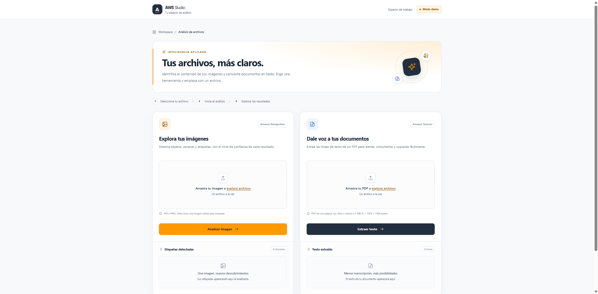
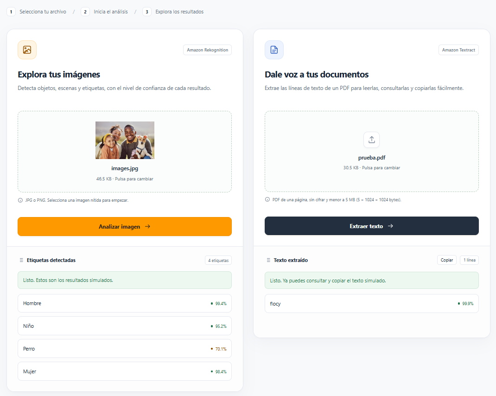

# AWS Rekognition y Textract - Analizador de Imágenes y Texto en PDF

Un proyecto académico sencillo para demostrar la integración de servicios de Inteligencia Artificial utilizando las API de AWS Rekognition y AWS Textract con Node.js y Express.

Este proyecto está diseñado con fines educativos e implementa mocks (simulaciones) del SDK de AWS, lo que permite realizar pruebas locales de detección de etiquetas (objetos, personas, etc.) y detección de texto en PDF sin consumir recursos reales ni generar costos en la nube.

## 📸 Capturas de pantalla

### Interfaz principal



### Análisis de imágenes con AWS Rekognition y Detección de texto en PDF con AWS Textract




## Características

- **Subida de imágenes:** Manejo de archivos multipart usando Multer.
- **Detección de etiquetas:** Simulación de la respuesta de AWS Rekognition (`DetectLabelsCommand`).
- **Detección de texto en PDF:** Simulación de la respuesta de AWS Textract (`DetectDocumentTextCommand`) mediante la ruta `/api/detect-text`, enviando el archivo en el campo `documento`.
- **Validación de PDF:** Solo se permiten archivos de una página, no cifrados y con un tamaño estrictamente inferior a 5 MiB (5 × 1024 × 1024 bytes). Se comprueban la extensión, el tipo MIME, la cabecera y la lectura del documento con `pdf-lib`.
- **Interfaz:** Frontend limpio y responsivo escrito en HTML, CSS (Vanilla) y JavaScript puro.
- **Entorno seguro:** Configuración de variables de entorno mediante `.env`.

## Tecnologías utilizadas

- **Backend:** Node.js y Express.js.
- **AWS SDK:** `@aws-sdk/client-rekognition` y `@aws-sdk/client-textract` (v3).
- **Validación de PDF:** `pdf-lib`.
- **Testing/Mocking:** `aws-sdk-client-mock`.
- **Frontend:** Vanilla JavaScript, HTML5 y CSS3.

## Requisitos previos

Antes de ejecutar este proyecto, asegúrate de tener instalado:

- Node.js (versión 18 o superior recomendada).
- NPM (incluido con Node.js).

## Instalación y configuración

### 1\. Clonar o descargar el repositorio

Clona o descarga el repositorio del proyecto.

### 2\. Instalar las dependencias

Navega al directorio del proyecto y ejecuta:

```
npm install
```

### 3\. Configurar las variables de entorno

Copia el archivo `.env-example` y renómbralo a `.env`:

```
cp .env-example .env
```

**Nota:** Dado que el proyecto utiliza mocks de AWS, no es obligatorio configurar credenciales reales en el archivo `.env` para que la aplicación local funcione.

## Cómo ejecutar el proyecto

Para iniciar el servidor local, ejecuta el siguiente comando:

```
node server.js
```

La aplicación estará disponible en tu navegador en:

[http://localhost:3000](<http://localhost:3000>)

## ¿Cómo funciona el mock de AWS?

Para evitar costos durante el desarrollo académico, el archivo `server.js` intercepta las llamadas de las clases `RekognitionClient` y `TextractClient` utilizando la librería `aws-sdk-client-mock`.

### AWS Rekognition

Cuando envías una imagen, el backend no realiza una petición real a Amazon, sino que devuelve las siguientes etiquetas estáticas dentro del campo `labels` de la respuesta:

```
[
  {
    "Name": "Hombre",
    "Confidence": 99.4
  },
  {
    "Name": "Niño",
    "Confidence": 95.2
  },
  {
    "Name": "Perro",
    "Confidence": 70.1
  },
  {
    "Name": "Mujer",
    "Confidence": 98.4
  }
]
```

Estas etiquetas son datos simulados y no representan un análisis real de la imagen enviada.

### AWS Textract

Cuando envías un PDF válido a `/api/detect-text`, el backend valida el archivo y devuelve una respuesta simulada con los campos `success`, `DocumentMetadata` y `Blocks`.

El mock indica una página y contiene bloques de tipo `PAGE`, `LINE` y `WORD`.

El texto de prueba es siempre `"flocy"`, independientemente del contenido del PDF. En este modo no se realiza una extracción real de texto.

## Conexión con AWS real

Para conectar el proyecto a los servicios reales de AWS, debes:

1. Desactivar o eliminar ambos mocks de AWS Rekognition y AWS Textract.
2. Eliminar o ajustar el endpoint `http://localhost:4566` de cada cliente, si está configurado.
3. Configurar la región de AWS correspondiente.
4. Configurar las credenciales de AWS de forma segura.
5. Asignar los permisos IAM necesarios para utilizar Rekognition y Textract.
6. Comprobar el funcionamiento de las respuestas reales de ambos servicios.


## Propósito académico

Este proyecto permite comprender la integración de servicios de inteligencia artificial de AWS en una aplicación web con Node.js y Express, así como la carga de imágenes, la validación de documentos PDF y el uso de mocks para simular respuestas de servicios externos.

El uso de simulaciones facilita las pruebas locales sin consumir recursos reales de AWS ni generar costos en la nube.